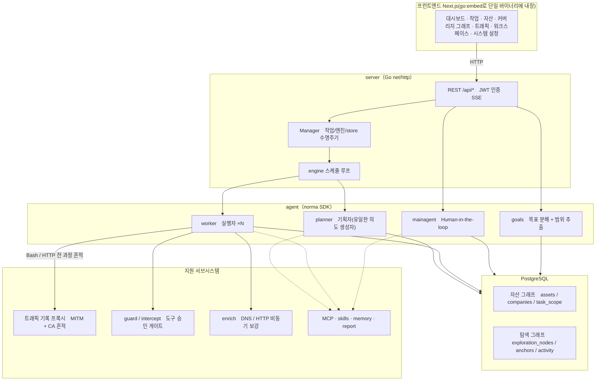
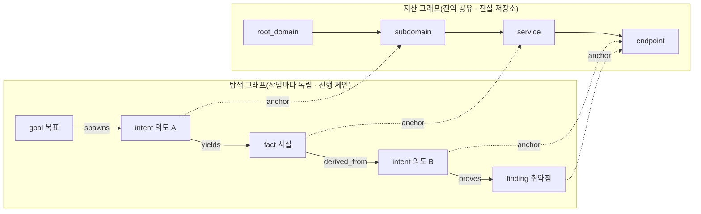
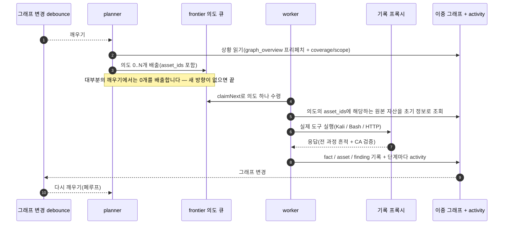
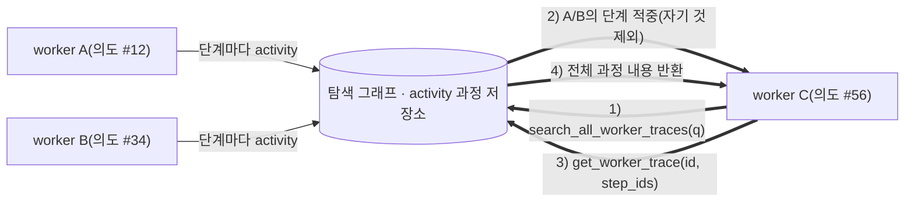
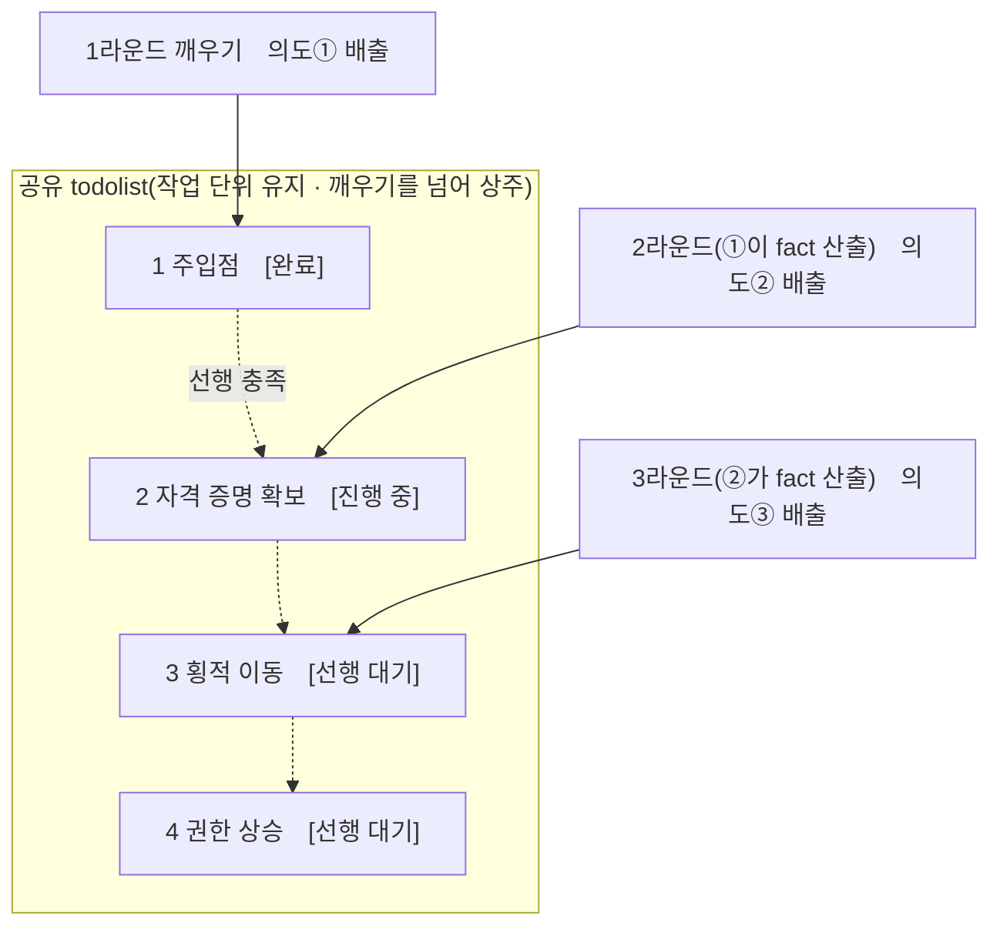

<div align="center">

# ARTEX

**한국어 UI 포크** · [원본 프로젝트 Autumn-27/ARTEX](https://github.com/Autumn-27/ARTEX) · [이 포크 wnduddld0513/ARTEX-KR](https://github.com/wnduddld0513/ARTEX-KR)

AI 자율 침투 테스트 시스템 (Go 백엔드 + Next.js 프런트엔드)

📘 **한국어 빌드 안내**: [소스에서 Windows/Linux 빌드](#방법-4-소스에서-단일-바이너리-컴파일) · [실행 환경 요구 사항](#실행-환경-요구-사항) · [전체 설치 안내](#설치)

🌐 **온라인 데모**: [https://artex-demo.vercel.app/](https://artex-demo.vercel.app/) — 원본 프로젝트의 **화면 데모로, 모의 데이터만 사용하며 실제 백엔드가 아닙니다**. 실제 백엔드는 이 저장소에 포함되어 있습니다.

</div>

---

> **한국어 UI 범위**: 메뉴, 작업 화면, 자산·취약점 관리, 채팅, 시스템 설정, 알림과 데모 데이터를 한국어로 제공합니다. 사용자 문서는 한국어로, 에이전트가 읽는 `skills/`의 스킬 지침과 참고 문서는 영어로 제공합니다. **사용자 입력, 외부 도구 출력, 모델 응답, 기존 데이터베이스에 들어 있는 내용, 에이전트 프롬프트는 원문 그대로 유지**됩니다. 원본의 라이선스와 저작권 고지도 그대로 유지합니다. 짧은 안내 파일 [README.ko.md](README.ko.md)는 이 문서로 통합되었습니다.

## 스크린샷

> 전체 상호작용은 [온라인 데모](https://artex-demo.vercel.app/)에서 확인하세요.
>
> 아래 스크린샷은 원본 프로젝트의 화면입니다. 한국어 포크와 표시 문구가 다를 수 있습니다.

| 대시보드(개요 / 토큰 소비 / 활동 피드) | 작업 목록 |
| :---: | :---: |
|  |  |

| 작업 · 실행 과정(세션 / 도구 호출) | 공격 경로 |
| :---: | :---: |
|  |  |

| 발견 | 자산 |
| :---: | :---: |
|  |  |

| 자산 커버리지 그래프(포스 레이아웃 · 테스트 완료 하이라이트 · 노드 접기/펼치기) |
| :---: |
|  |

| 트래픽 기록 | Human-in-the-loop 대화 |
| :---: | :---: |
|  |  |

| Agent 관리 | LLM 설정 |
| :---: | :---: |
|  |  |

| 차단 승인 | 백엔드 로그 |
| :---: | :---: |
|  |  |


---

## 승인 기록 상세

전역 「승인 기록」, 작업 안의 「차단 승인」, 대화의 승인 카드 모두에서 펼쳐 상세를 볼 수 있습니다. 표시 구조는
[AegisHook의 승인 상세 컴포넌트](https://github.com/RuoJi6/AegisHook/blob/main/web/src/components/CallDetail.vue)를 참고했고, ARTEX의 컴포넌트와 테마를 그대로 사용합니다:


## 자산 동기화(ScopeSentry)

[ScopeSentry](https://github.com/Autumn-27/ScopeSentry)에서 자산 데이터를 바로 동기화해 중복 수집을 줄일 수 있습니다:

- 「**자산 동기화**」 페이지에 ScopeSentry 주소와 API Key를 입력해 데이터 소스를 연결합니다;
- **프로젝트** 또는 **작업** 기준으로 동기화할 대상과 자산 유형(도메인 / 서브도메인 / IP / 포트 / 사이트 / 엔드포인트…)을 고릅니다;
- 한 번에 가져와 회사 자산 범위로 병합하면, 그대로 ARTEX 자산 그래프에 들어가 agent 탐색에 쓰입니다.

---

## 설치

> 데이터베이스로 **PostgreSQL**이 필요하고, 탐색에는 **LLM** 설정이 필요합니다(`ANTHROPIC_API_KEY` 또는 `OPENAI_API_KEY`, UI에서 설정해도 됩니다).
>
> 이 문서의 저장소·릴리스 주소는 한국어 포크인 **`wnduddld0513/ARTEX-KR`** 기준입니다. 원본 프로젝트는 [Autumn-27/ARTEX](https://github.com/Autumn-27/ARTEX)이며, 원본의 저작권과 라이선스 고지는 그대로 유지됩니다.

### 방법 1: 원클릭 설치 스크립트(권장)

```bash
git clone https://github.com/wnduddld0513/ARTEX-KR.git
cd ARTEX-KR
./install.sh
```

스크립트는 Docker를 감지·자동 설치한 뒤 **① 전부 Docker** 또는 **② 로컬 컴파일 실행** 중 하나를 고르게 합니다:

- **① 전부 Docker**: Postgres 비밀번호를 입력(엔터로 무작위 생성) → `.env` 자동 작성 → `docker compose up -d`.
- **② 로컬 실행**: 데이터베이스 선택(기존 연결 / Docker로 하나 기동) → `config.json` 생성 → `go`로 프런트엔드를 내장한 단일 바이너리 컴파일 → 실행.

설치가 끝나면 **http://localhost:8787** 을 엽니다(첫 접속 시 `/setup`에서 관리자 비밀번호를 설정).

> `install.sh`는 bash 스크립트입니다. Windows에서는 Git Bash나 WSL에서 실행하거나, 아래 **방법 4**의 PowerShell 빌드 절차를 따르세요.

### 방법 2: Docker Compose(수동)

```bash
git clone https://github.com/wnduddld0513/ARTEX-KR.git
cd ARTEX-KR
cp .env.example .env          # POSTGRES_PASSWORD, 선택 사항으로 ANTHROPIC_API_KEY 입력
docker compose up -d          # autumn27/artex 이미지 + postgres 내려받기
# → http://localhost:8787
```

> ⚠️ **기본 Docker 이미지에는 한국어 UI가 들어 있지 않습니다.** `docker-compose.yml`이 받는 `autumn27/artex`는 **원본(업스트림) 이미지**라서 이 포크의 한국어 UI가 포함되지 않습니다. 한국어 UI로 쓰려면 이 저장소 소스로 직접 빌드한 바이너리나 이미지를 사용하세요. 이 저장소의 `Dockerfile`은 **미리 빌드해 둔 Linux 바이너리** `dist/<아키텍처>/artex`를 요구하므로, 아래 방법 4로 바이너리를 만든 뒤 `docker build -t artex:local .`로 이미지를 만들면 됩니다.

이미지에는 자주 쓰는 도구(ripgrep/curl/vim/npm/nmap…)가 들어 있고, `./skills`와 `./data`는 바인드 마운트로 영속화됩니다.

원격 MCP는 시스템 설정에서 `http`(Streamable HTTP) 또는 `sse`(구형 SSE)를 선택할 수 있습니다.
구형 SSE 서비스는 보통 `GET /sse`로 이벤트 스트림을 열고, 서비스가 돌려주는
`/message?sessionId=...`로 JSON-RPC 요청을 받습니다. 설정할 때 URL은 `/sse`, 요청 헤더는
`Authorization=Bearer <token>` 형식으로 넣습니다.

### 방법 3: 미리 빌드된 바이너리 내려받기(Releases)

[Releases](https://github.com/wnduddld0513/ARTEX-KR/releases)에서 해당 플랫폼의 zip을 내려받아 압축을 풀면 `artex` + `start.sh`(Windows는 `start.bat`) + `skills/` + `config.example.json`이 나옵니다:

```bash
cp config.example.json config.json   # database 연결 정보 입력
./start.sh                           # → http://localhost:8787
```

> `./artex`를 직접 실행하지 말고 `start.sh` / `start.bat`으로 실행하세요. 이 스크립트는 데몬 역할을 합니다: 프로그램이 끝나면 종료 코드에 따라 다시 띄울지 판단하고, **페이지의 [원클릭 업데이트](#방법-1-페이지-원클릭-업데이트권장)가 이 스크립트를 통해 바이너리를 교체**합니다. `./artex`를 직접 실행하면 업데이트 후에 다시 뜨지 않습니다.
> 백그라운드 상주: `nohup ./start.sh >artex.log 2>&1 &`.

### 방법 4: 소스에서 단일 바이너리 컴파일

```bash
# 1) 프런트엔드 정적 내보내기
cd web && npm ci && npm run build:static && cd ..
# 2) 내장 디렉터리로 복사
mkdir -p server/webui/dist
cp -r web/out/. server/webui/dist/
# 3) 컴파일 (-tags embedui 여야 프런트엔드가 내장됩니다)
CGO_ENABLED=0 go build -tags embedui -o artex ./cmd/artex
./start.sh
```

Windows(PowerShell)에서는 다음과 같습니다:

```powershell
git clone https://github.com/wnduddld0513/ARTEX-KR.git
cd ARTEX-KR
Copy-Item config.example.json config.json
# config.json의 PostgreSQL 연결 정보를 설정합니다.
cd web
npm.cmd ci
npm.cmd run build:static
cd ..
New-Item -ItemType Directory -Force server/webui/dist | Out-Null
Copy-Item web/out/* server/webui/dist -Recurse -Force
$env:CGO_ENABLED = "0"
go build -tags embedui -o artex.exe ./cmd/artex
.\start.bat
```

### 방법 5: 크로스 플랫폼 Release 압축 패키지 빌드

`build.sh`는 프런트엔드를 먼저 빌드해 내장한 뒤, Go 링커로 디버그 정보를 제거하고 배포 파일을 zip으로 압축합니다. Release 모드는 기본적으로 Linux amd64/arm64, macOS amd64/arm64, Windows amd64용 zip을 만듭니다:

```bash
./build.sh --release
# 산출물: dist/artex-0.3.3-*.zip
```

UPX 자기압축 바이너리는 일부 Linux 커널, 가상화 환경 또는 보안 정책과 호환되지 않을 수 있어 기본적으로 켜지 않습니다. `ARTEX_TARGETS`로 대상을 지정할 수 있고, 대상 실행 환경이 호환된다고 확인되면 `--upx`를 명시해 바이너리를 더 줄일 수 있습니다:

```bash
ARTEX_TARGETS=linux/amd64,windows/amd64 ./build.sh --release
./build.sh --target linux/amd64 --upx
```

### 실행 환경 요구 사항

- **Go 1.26.3 이상**, **Node.js 22 이상**, **PostgreSQL**.
- 에이전트 실행 도구 라이브러리 `norma v0.4.3`은 Windows에서 일반 명령을 **PowerShell**로, Linux·macOS에서 **Bash**로 실행합니다.
- **Windows의 대화형 터미널(PTY)은 아직 지원하지 않습니다.** 대화형 도구가 필요하면 Linux, WSL2 또는 Linux 컨테이너에서 실행하세요.
- 외부 도구는 실행 환경에 설치되어 있어야 합니다. 브라우저는 서버에 접속하는 관리 화면이고, 도구와 명령은 백엔드가 실행되는 컴퓨터에서 실행됩니다.

---

## 업데이트

> 업데이트는 프로그램만 교체하고 데이터는 건드리지 않습니다: Postgres 데이터 볼륨 `pgdata`, `./data`(jwt.key / SQLite 등), `./skills`는 모두 유지됩니다. **데이터베이스 마이그레이션은 수동으로 실행할 필요가 없습니다** — `artex`는 시작할 때마다 `schema.sql`(`ADD COLUMN` / `CREATE INDEX IF NOT EXISTS` 포함)을 멱등하게 다시 실행합니다. 즉 "재시작이 곧 마이그레이션"입니다. 그래도 업데이트 전에는 `./data`와 데이터베이스를 백업해 두는 것이 좋습니다.

### 방법 1: 페이지 원클릭 업데이트(권장)

**시스템 설정** 페이지(사이드바 「시스템 설정」 → `/system/settings`)의 **버전과 업데이트** 카드에서 서버에 로그인하지 않고도 새 버전을 확인하고 설치할 수 있습니다.

「업데이트」를 누르면: 현재 플랫폼의 릴리스 패키지를 내려받고 → 릴리스의 `SHA256SUMS`와 대조하고 → `-h`로 새 바이너리에 스모크 테스트를 하고 → `artex.new`로 임시 저장한 뒤 → 프로그램이 종료되면 `start.sh` / `start.bat`이 다시 띄우면서 교체를 마칩니다. 페이지는 새 버전이 올라오면 자동으로 기다렸다가 새로고침합니다.

- **실패해도 망가진 프로그램이 남지 않습니다**: 검증이나 스모크 테스트를 통과하지 못하면 임시 파일을 버리고 현재 버전으로 계속 실행합니다. 교체된 새 버전이 연속 3회 시작에 실패하면 `artex.old`로 자동 롤백합니다(실패한 쪽은 `artex.failed`로 남겨 조사에 사용).
- **언제든 되돌릴 수 있습니다**: 이전 버전은 `artex.old`로 남고, 카드에 「이전 버전으로 롤백」이 있습니다. 단, 데이터베이스 구조는 되돌아가지 않습니다.
- **업데이트는 실행 중인 작업을 중단시킵니다** — 업데이트가 곧 재시작이므로 한가할 때 진행하세요.
- **개발 빌드에는 업데이트를 제공하지 않습니다**: 버전이 `dev`이거나 `git describe`에 접미사가 붙으면 비활성화되어, 정식 버전이 로컬 디버그 바이너리를 덮어쓰지 않습니다.
- **Docker에서는 프로그램만 교체되고 이미지는 교체되지 않습니다**: 이미지 안의 playwright / nmap 등 도구 체인은 함께 올라가지 않고, `docker compose up -d`로 컨테이너를 다시 만들면 이미지에 들어 있던 버전으로 돌아갑니다. 이미지까지 올리려면 `docker compose pull artex && docker compose up -d artex`를 쓰세요.
- GitHub 접속에 프록시가 필요하면 같은 페이지에서 **전역 프록시**를 설정하면 됩니다. 업데이트 경로가 그 프록시를 탑니다. 업데이트는 GitHub 도메인에서만 내려받고 HTTPS를 강제합니다.

> **업데이트 소스**: 이 포크의 자동 업데이트는 **`wnduddld0513/ARTEX-KR`의 릴리스**를 확인합니다(코드의 `selfupdate.Repo` 기준). 이 포크에 릴리스가 없으면 설치할 새 버전도 없습니다. 한국어 UI를 최신으로 유지하려면 이 저장소의 릴리스를 쓰거나 직접 빌드한 바이너리를 쓰세요. 기본 Docker 이미지(`autumn27/artex`)를 쓰는 경우, 이미지 갱신은 원본(업스트림) 이미지를 따라가며 한국어 UI는 포함되지 않습니다.

### 방법 2: 원클릭 업데이트 스크립트

```bash
cd ARTEX-KR
./update.sh
```

스크립트는 먼저 선택적으로 `git pull`로 최신 코드를 받고, **① Docker 업데이트** 또는 **② 로컬 컴파일 업데이트**( `install.sh`와 대응)를 고르게 합니다:

- **① Docker**: 대상 이미지 tag를 지정할 수 있고(엔터 시 `.env`의 `ARTEX_TAG`, 없으면 `latest`) → `docker compose pull` → `docker compose up -d`(새 이미지로 재시작하면 자동 마이그레이션).
- **② 로컬**: 프런트엔드 정적 산출물 재빌드 → `./artex` 재컴파일(완료 후 프로세스를 재시작하면 반영).

### 방법 3: Docker Compose(수동)

```bash
cd ARTEX-KR
git pull                       # compose / 스크립트 갱신(선택)
# 버전 지정: .env에 ARTEX_TAG=v0.2.0 설정. 미설정이면 latest
docker compose pull artex
docker compose up -d artex     # 새 이미지로 재시작 → schema 자동 마이그레이션
docker image prune -f          # 이전 이미지 정리(선택)
```

### 방법 4: 미리 빌드된 바이너리(Releases)

[Releases](https://github.com/wnduddld0513/ARTEX-KR/releases)에서 새 버전 zip을 내려받아, 기존 프로세스를 멈춘 뒤 `artex`와 `skills/`를 덮어쓰고(`config.json`과 `data/`는 유지) 다시 시작합니다:

```bash
cp -r <압축 해제 디렉터리>/skills ./ && cp <압축 해제 디렉터리>/artex ./
./start.sh
```

### 방법 5: 소스에서 컴파일

```bash
git pull
cd web && npm ci && npm run build:static && cd ..
cp -r web/out server/webui/dist
CGO_ENABLED=0 go build -tags embedui -o artex ./cmd/artex
# ./start.sh 재시작
```

---

## 설정

**데이터베이스**(`config.json`, 또는 환경 변수 `ARTEX_PG_DSN`으로 덮어쓰기):

```json
{
  "database": {
    "host": "127.0.0.1", "port": 5432,
    "user": "artex", "password": "yourpass",
    "dbname": "artex", "sslmode": "disable"
  }
}
```

**LLM**: `export ANTHROPIC_API_KEY=sk-...`(또는 `OPENAI_API_KEY`). UI의 「LLM 설정」 페이지에서 입력해도 됩니다.
선택: `ARTEX_LLM_PROVIDER` / `ARTEX_LLM_MODEL` / `ARTEX_LLM_BASE_URL` / `ARTEX_LLM_PROXY`.

**동시성**: 작업마다 work agent 수는 「시스템 설정」에서 구성합니다(기본 3).

**자주 쓰는 인자**: `./start.sh -addr :8787 -proxy :8788`(`-addr` 프런트엔드+API, `-proxy` 트래픽 기록 프록시). 시작 스크립트는 인자를 그대로 `artex`에 전달합니다.

---


## 개발

### 수동 취약점 재검증

작업 상세의 「재검증」 탭에서 이 작업의 취약점을 페이지 단위로 골라 보고, 지난 결론과 증거를 확인하고, 재검증을 직접 시작할 수 있습니다. 시작하면 현재 탭이 유지되고 로딩 아이콘과 「재검증 중」이 표시되며, 수정이 확인되면 취약점 상태가 함께 갱신됩니다.

취약점 목록의 각 행 작업 영역에서 「재검증」을 누르거나, 취약점 상세의 「취약점 재검증」 영역에서 「재검증 시작」을 눌러 수정 버전, 테스트 조건이나 제한을 선택적으로 적으면 됩니다. 시스템은 독립된 재검증 Agent 세션을 만들고, 시작해도 현재 페이지는 그대로 유지합니다. 목록의 평면 뷰, 작업별 그룹 뷰, 자산 뷰 모두 이 진입점을 지원합니다. 재검증이 도는 동안에는 로딩 아이콘과 「재검증 중」이 보이고, 확인이 필요하면 눌러 해당 세션으로 들어가며, 끝나면 「재검증」으로 돌아옵니다. 재검증을 위해 원래 스캔 작업을 다시 시작할 필요는 없습니다. 결론은 「여전히 재현됨」「수정됨」「확인할 수 없음」으로 나뉘고, 매번의 결론·증거·세션 링크는 취약점 상세에 저장됩니다.

새 백엔드가 처음 시작될 때 편집 가능한 「취약점 재검증」(`retester`) Agent가 미리 만들어지며, Agent 관리에서 프롬프트·LLM·실행 예산·도구를 설정할 수 있습니다. 기본적으로 그 Agent에 연결된 LLM을 쓰고, 연결이 없으면 전역 활성 설정을 씁니다. 재검증 세션이 성공적으로 끝나고 결론이 「수정됨」이면 시스템이 취약점 처리 상태를 자동으로 「수정됨」으로 바꿉니다. 실행 중, 실패, 중지 또는 다른 결론이면 원래 상태를 유지합니다. 원본 증거와 보고서는 항상 남습니다. 상태 드롭다운에서 「수정됨」을 직접 고를 수도 있습니다. 같은 취약점을 재검증하는 중이면 이미 있는 세션을 재사용하고, 중지·실패·서비스 재시작 후에는 다시 시작할 수 있습니다.

이 버전의 이력은 취약점 상세와 세션에서 확인하며, 아직 취약점 보고서 내보내기나 작업 아카이브 패키지에는 포함되지 않고 트래픽 패키지와도 자동으로 연결되지 않습니다. 데모 모드는 분명히 표시된 모의 기록만 만들고 실제 대상에 요청을 보내지 않습니다.

### 로컬 실행과 테스트

```bash
./dev.sh    # 백엔드(:8787) + 트래픽 프록시(:8788) + 프런트엔드 next dev(:5173) → http://localhost:5173
```

- 백엔드: `go run ./cmd/artex`(`-tags embedui` 없이 실행하면 프런트엔드가 내장되지 않습니다)
- 프런트엔드: `cd web && npm run dev`(`/api`를 백엔드로 리버스 프록시, 핫 리로드 지원)
- 테스트: `go test ./...`
- Mock 미리보기(백엔드 없음): `cd web && NEXT_PUBLIC_MOCK=1 npm run dev`

---

## 시스템 기술 아키텍처

ARTEX는 **LLM 멀티 agent가 이끄는 자율 침투 시스템**입니다: Go 단일 프로세스 백엔드(Next.js 프런트엔드 내장) + PostgreSQL로 구성되고, agent 기능은 [`norma`](https://github.com/Autumn-27/norma) SDK(`agentcore` / `tool` / `permission` / `harness` / `memory` / `transcript`)가 제공합니다. 핵심은 **이중 그래프 아키텍처**와, 그를 둘러싼 두 가지 자율성 메커니즘 — **worker 간 과정 수준 정보 교환**과 **planner의 여러 라운드에 걸친 공유 todolist로 안정적인 공격 경로 만들기** — 입니다.

### 전체 계층



| 계층 | 역할 |
| --- | --- |
| **프런트엔드** | Next.js 정적 내보내기를 `go:embed`로 단일 바이너리에 내장. 작업/자산/탐색 경로/커버리지 그래프 시각화와 Human-in-the-loop 대화 |
| **server** | `net/http` 라우팅 + JWT 인증 + SSE. `Manager`가 작업·엔진·DB store 수명주기를 관리 |
| **engine** | 작업마다 `plannerLoop` 하나 + worker goroutine N개. 의도 수령, 타임아웃/일시정지/drain |
| **agent** | goals / planner / worker / mainagent. `ToolSet`이 이중 그래프를 LLM 도구로 노출 |
| **db** | 이중 그래프를 Postgres(pgx)에 저장. schema는 `go:embed`를 통해 시작할 때마다 멱등하게 생성 |
| **지원** | 기록형 MITM 프록시, 승인 게이트, 비동기 보강, MCP/스킬/기억/보고서 |

### 이중 그래프 아키텍처: 탐색 그래프 + 자산 그래프

시스템은 「**목표가 무엇인가**」와 「**어디까지 테스트했는가**」를 서로 독립적이면서 앵커로 연결된 두 그래프로 나눕니다:

- **자산 그래프(Asset Graph, 전역 공유)**: 작업을 가로질러 하나뿐인 자산 진실 저장소입니다. 노드는 `root_domain / subdomain / ip / service / app / endpoint`이고 회사에 귀속됩니다. 도메인→서브도메인→서비스→엔드포인트의 부모-자식 관계와 중복 제거 key는 모두 프로그램이 계산하며, agent는 원본 정보만 제출합니다.
- **탐색 그래프(Exploration Graph, 작업마다 독립)**: 한 작업의 "생각과 진행" 과정입니다. 노드는 `goal(목표) / intent(의도) / fact(사실) / finding(취약점) / hint(힌트)`이고, `spawns / derived_from / yields / proves` 같은 간선으로 **혈연 체인**을 이뤄 "어느 방향이 어떤 사실에서 파생되어 무엇을 만들어 냈는가"에 답합니다.
- **두 그래프는 앵커로 연결됩니다**: `exploration_anchors(node_id, asset_id)`가 의도/사실/취약점을 구체적인 자산에 고정합니다. 그래서 "탐색 방향"에서 어떤 자산을 공략했는지 볼 수 있고, "어떤 자산"에서 이 작업 중 어떤 의도로 테스트했고 어떤 사실을 얻었는지 역으로 조회할 수 있습니다. 이 구조가 **자산 테스트 커버리지**와 **자산 커버리지 그래프**(범위 안 자산 + 테스트 완료 하이라이트)를 떠받칩니다.



> 역할 분담: **planner**는 탐색 그래프의 상황을 읽고 목표를 판단하며, 아직 덮지 않은 새 방향이 있을 때만 **의도**를 frontier에 넣습니다. **worker**는 **의도 하나**를 받아 실제 도구로 실행하고, 새 자산/사실/취약점을 두 그래프에 기록한 뒤 멈춥니다. 자산 그래프는 공유 진실이고, 탐색 그래프는 작업마다의 진행 체인입니다.

### 엔진과 의도 수명주기(한 번의 탐색이 닫히는 고리)

엔진은 **이벤트 기반** 폐루프입니다: 그래프가 바뀌면 planner를 깨우고, planner가 의도를 내보내고, worker가 의도를 받아 실행하고 되쓰면, 그 되쓰기가 다음 라운드를 다시 깨웁니다 — 목표가 증명될 때(`prove_goal`)까지 이어집니다.



### worker 간 과정 수준 정보 교환

깊은 탐색에서는 값진 관찰(어떤 오류, 어떤 응답 조각, 어떤 숨은 파라미터)이 한 worker의 **실행 과정**에서 나오지만, 꼭 정식 fact로 기록되지는 않습니다. 중복 작업을 피하고 체인 위의 worker가 서로의 어깨에 올라서게 하려고, worker는 **다른 work의 과정을 검색**하는 능력을 갖습니다:

- `search_all_worker_traces(q)`: **이 작업의 다른 work 실행 과정**에서 키워드로 검색합니다(자기 의도의 단계는 자동 제외). 검색 결과에는 `intent_id`가 붙습니다;
- `list_worker_traces` / `get_worker_trace(intent_id, step_ids=[…])`: 어떤 work가 돌았는지 먼저 보고, 특정 work의 특정 단계 내용을 통째로 받아 세부를 교환합니다.

이렇게 하면 탐색 그래프에 아직 대응하는 fact가 없어도 뒤따르는 worker가 남의 과정에서 나온 관찰을 재사용할 수 있습니다 — **정보가 worker 사이에서 "실행 과정" 단위로 흐르되**, 경계는 그대로입니다(각 worker는 여전히 자기 의도 하나만 수행).



### planner의 여러 라운드에 걸친 공유 todolist → 안정적인 공격 경로

실제 공격 체인은 대개 **앞뒤 의존이 있는 여러 단계의 연속**(예: 주입점 발견 → 자격 증명 확보 → 횡적 이동 → 권한 상승)이라, 한 번에 전부 병렬로 내보내면 엉킵니다. 그래서 planner는 **작업 단위로 유지되고 깨우기를 넘어 공유되는 계획 할 일 목록(todolist)** 을 들고 있습니다:

- planner는 이벤트 기반이라 그래프가 바뀌면 깨워지지만, **깨워질 때마다 완전히 새 세션**입니다. 공유 todolist가 있으므로 직렬 이용 체인을 **한 번 기록해 두고**, 이후 여러 라운드에 걸쳐 **의존 순서대로 의도를 하나씩 내보냅니다**. 체인 전체를 한 라운드에 몰아서 펼치지 않습니다;
- 매 라운드에는 「앞 단계가 끝났고 의존하는 fact가 이미 있는」 다음 단계에만 의도를 내보내고, 진행에 맞춰 목록을 갱신합니다(fact로 충족된 단계는 완료로 표시).



그래서 공격 체인은 "이벤트 기반 + 무상태 세션" 환경에서도 **안정적으로 나아가고, 중복되지 않고, 순서가 틀어지지 않습니다** — 이것이 ARTEX가 여러 단계의 이용 체인을 자율적으로 끝까지 가는 핵심입니다.

---

## 커뮤니티

위챗 공식 계정 **SecSentry**를 팔로우한 뒤, 공식 계정 백엔드로 메시지를 보내면 그룹에 초대됩니다.

<div align="center">


</div>

---
## 참고

https://github.com/oritera/Cairn


## 라이선스와 면책 조항

### 오픈소스 라이선스

이 프로젝트는 **GNU Affero General Public License v3.0(AGPL-3.0)** 으로 배포되며, 전체 조항은 저장소 루트의 [LICENSE](LICENSE) 파일에 있습니다.

즉 누구나 이 프로젝트를 자유롭게 사용·수정·배포할 수 있지만, **2차적 저작물도 반드시 AGPL-3.0으로 공개**해야 합니다. 특히 **이 프로젝트를 수정해 네트워크(예: 온라인 서비스로 배포)를 통해 사용자에게 제공한다면, 그 사용자에게 대응하는 전체 소스 코드도 공개해야 합니다**.

> ⚠️ **중요**: 오픈소스 라이선스 자체는 소프트웨어의 사용 목적을 제한하지 않습니다. 아래의 「사용 제한」과 「면책 조항」은 저자가 사용자에게 덧붙이는 추가 약속이자 엄중한 선언이니 반드시 지켜 주세요.

**ARTEX는 개인 학습, 코드 연구, 로컬 기술 검증 용도로만 쓸 수 있으며, 어떤 온라인 시스템이나 웹사이트에도 실제 테스트를 가해서는 안 됩니다.**

### 허용되는 사용 범위

- 이 프로젝트의 소스 코드를 **읽고, 배우고, 연구**하는 용도와 **로컬 격리 환경**에서의 기술 원리 검증에만 쓸 수 있습니다;
- 개인 학습, 학술 연구, 코드 리뷰처럼 공격성이 없는 용도에 적합합니다.

### 금지 사항

- **이 도구로 어떤 웹사이트, 온라인 서비스, 네트워크에 연결된 시스템에도 스캔·탐지·이용·공격을 해서는 안 됩니다**(권한을 받았는지, 자기 자산인지와 무관합니다);
- 이 도구를 어떤 실제 침투 테스트, 공방 대항, 운영 환경에도 써서는 안 됩니다;
- 이 도구를 불법 침입, 데이터 탈취, 협박(랜섬), 서비스 거부 또는 어떤 파괴적·범죄적 활동에도 써서는 안 됩니다;
- 이 도구로 거주 국가/지역의 법률과 규정을 위반하는 행위를 해서는 안 됩니다.

### 준법 책임

사용자는 거주 국가/지역의 네트워크 보안, 데이터 보호, 컴퓨터 범죄에 관한 모든 법률과 규정을 스스로 지켜야 합니다(중국 본토에서는 「네트워크 안전법」, 「데이터 안전법」, 「개인정보 보호법」 및 관련 사법 해석을 포함하되 이에 국한되지 않습니다). **이 도구를 사용해 발생하는 모든 법적 책임과 결과는 사용자 자신이 부담합니다.**

### 면책 조항

이 프로젝트는 「있는 그대로(AS IS)」 제공되며, 명시적이든 묵시적이든 어떤 보증도 붙지 않습니다. 저자와 기여자는 이 도구를 사용(사용 방식이 적절했는지와 무관)해 생긴 어떤 직접적·간접적 손실, 데이터 유실, 시스템 손상 또는 법적 분쟁에도 책임지지 않습니다. **이 프로젝트를 내려받거나 설치하거나 사용하면, 위의 모든 조항을 읽고 이해하고 동의한 것으로 봅니다.**
