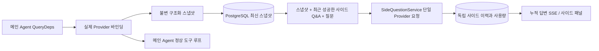

# ARTEX `/btw`

일반 채팅, 작업 MainAgent, 현재 작업의 Worker가 각각 독립적인 사이드 질문을 지원합니다. 메인 입력창에 `/btw 질문`을 입력하면 제출되고, 빈 `/btw`나 「사이드 질문」 버튼으로 이력을 엽니다. 데스크톱은 너비를 조절할 수 있는 사이드 패널, 모바일은 Drawer를 씁니다.

사이드 답변은 제출 시점의 Agent 컨텍스트 스냅샷을 바탕으로 생성되며, 스트리밍 표시·추가 질문·중지·비우기를 지원합니다. 패널을 닫거나 페이지를 새로고침하거나 SSE가 끊겨도 모델 요청은 취소되지 않습니다. 중지는 현재 사이드 질문에만 영향을 주고, 비우기는 사이드 질문을 취소하고 사이드 이력을 삭제하며 메인 컨텍스트 스냅샷은 유지합니다.

## 구현 범위

Go, norma v0.3.7, Next.js, 기존 Markdown / ResizablePanel / Drawer / AlertDialog 컴포넌트를 그대로 사용했습니다. norma 소스를 수정하거나 사이드 질문을 위해 의존성을 추가하지 않았습니다. Planner, 다른 작업에서 상속된 Worker, 도구형 하위 작업 승격은 이번 범위가 아닙니다.

- `capture.go`는 `Options.Deps.CallModel / CallModelSync`에서 메인 루프 요청만 표시합니다. Provider 데코레이터는 구체 모델 내부, 라우팅 풀 바깥 선택 뒤에 있으므로 실제로 선택된 모델을 기록합니다. 압축과 요약 요청은 스냅샷을 덮어쓰지 않습니다.
- 요청 시작, 전체 모델 응답, 실행 종료 상태에서 스냅샷을 발행합니다. 생성 중인 반쪽 응답은 발행하지 않습니다. 도구 호출은 norma의 `MessagesForAPI`로 짝을 유지하고, 도구 결과는 다음 메인 모델 요청이나 실행 종료 상태에서 스냅샷에 들어갑니다. 스트리밍 중단 시에는 마지막으로 유효한 경계를 유지합니다.
- 스냅샷은 JSON 깊은 복사로 구조화 메시지, 시스템 프롬프트, 도구 정의와 생성 파라미터를 보존합니다. 모델 추론은 스냅샷 잠금이나 데이터베이스 트랜잭션을 잡지 않습니다.
- `SideQuestionService`는 구체 Provider를 호출합니다. 필요하면 먼저 사이드 요약을 만들고, 최종 답변은 처음 컨텍스트를 초과했고 아직 텍스트/도구 호출을 출력하지 않았을 때만 축소 후 한 번 재시도할 수 있습니다. agent 세션을 만들지 않고, 도구 실행기·메인 transcript·활동 흐름·작업 그래프에 연결하지 않으며, 작업 모델 전환 체인도 거치지 않습니다. 답변에 도구 정의를 남기는 것은 기존 구조화 도구 컨텍스트와의 호환을 위해서입니다. 요약 요청에는 도구를 제공하지 않습니다. 새로 돌려받은 도구 호출에는 실행 경로가 없습니다.
- 상위 세션마다 실행 요청 하나, 단일 서비스 프로세스에서 최대 넷, 단일 타임아웃 120초입니다. 사이드 질문은 서비스 수명주기 아래의 독립 취소 컨텍스트를 씁니다.
- 사이드 요청은 모델 설정 참조와 민감하지 않은 식별 정보 요약을 보관하고, 요청할 때 기존 설정에서 자격 증명을 가져옵니다. 설정이 삭제되었거나 모델·프로토콜·주소 등 식별 필드가 바뀌면 먼저 메인 Agent를 실행해 스냅샷을 갱신해야 합니다. 테스트는 제품 기본 모델을 바꾸지 않습니다.

## 저장과 복구

`db/schema.sql`이 `side_question_sessions`와 `side_question_requests`를 자동으로 만듭니다. 앞은 상위 리소스, 최신 스냅샷, 실행 번호, 버전과 정리 버전을 저장하고, 뒤는 질문, 누적 답변, 상태, 모델, 스냅샷 시각, 사용량, 이벤트 순번과 페이지 순번을 저장합니다.

상위 세션 키는 conversation ID, 또는 task ID + exploration ID + intent ID를 씁니다. Worker는 재사용 가능한 실행 슬롯 이름을 쓰지 않습니다.

스냅샷은 상위 세션별로 모아서 쓰고 250ms마다 갱신하며, 데이터베이스가 `(run_id, version)`을 비교해 오래된 버전이 덮어쓰지 않게 합니다. 사이드 제출 전에 선택한 스냅샷을 다시 저장합니다. 저장에 성공하면 메모리에 있는 큰 스냅샷을 해제하고, 실패하면 기록 대기 버전을 남깁니다. 누적 답변 내용은 스트리밍 이벤트가 올 때 최대 250ms마다 한 번 쓰고, 종료 상태는 즉시 저장하며 데이터베이스 오류 시 제한적으로 재시도합니다.

서비스가 시작되면 남아 있던 `running` 요청을 `interrupted`로 표시하고, 이미 저장된 부분 답변과 사용량은 유지하며 요청을 자동으로 재생하지 않습니다. 최근에 성공적으로 저장된 컨텍스트는 다음 질문에 바로 쓸 수 있습니다. 스냅샷이 없는 예전 세션이면 먼저 메인 Agent를 실행해야 하며, UI 활동 기록에서 컨텍스트를 재구성하지 않습니다.

비우기는 정리 버전을 올리고 요청을 삭제합니다. 조건부 갱신이 늦게 도착한 콜백이 다시 기록하는 것을 막습니다. 물리적 상위 리소스 삭제는 외래 키 cascade에 의존하고, Worker 논리 삭제는 같은 트랜잭션에서 사이드 데이터를 지우며 뒤늦게 도착하는 스냅샷을 거부합니다. 작업 아카이브는 먼저 새 요청을 막고, 메인 흐름이 멈추기를 기다린 뒤, 사이드 질문을 취소하고 저장이 끝날 때까지 기다립니다. 아카이브 형식은 v3이고, 사이드 테이블이 없는 v1/v2도 함께 지원합니다.

이력은 전부 저장하고, 순번 커서 기준으로 페이지마다 최대 20건을 돌려줍니다. 모델 요청은 최근 성공한 Q&A 원문을 최대 20쌍까지 재생하고, 동시에 token 예산으로 재생량을 제한합니다. 더 오래된 Q&A는 별도의 롤링 요약으로 관리합니다. 메인 컨텍스트가 예산을 넘으면 사이드 사본의 오래된 부분만 요약하고, 최근 구조화 도구 호출과 결과는 유지합니다. 요약과 준비 진행 상황, 사용량은 사이드 질문의 동시성·취소·120초 타임아웃 제한에 함께 들어갑니다. 자세한 내용은 [컨텍스트 예산과 오픈소스 참고](CONTEXT_BUDGET.md)를 보세요.

## HTTP 계약

아래 경로에서 `{parent}`로 쓰이며, 기존 인증과 리소스 검증을 그대로 따릅니다:

- `/api/conversations/{id}`
- `/api/tasks/{id}/chat`
- `/api/tasks/{id}/intents/{iid}`

| 요청 | 반환 및 동작 |
| --- | --- |
| `GET {parent}/side-questions?before={ordinal}` | `items`는 최신→과거 순, 독립적인 `current` 실행 상태, `snapshot` 메타 정보, `next_cursor`; 커서가 0이면 최신 페이지 / 다음 페이지 없음 |
| `POST {parent}/side-questions` | JSON `{ "question": "…", "client_request_id": "UUID" }`; 새 요청이면 202와 요청 객체, 같은 ID와 같은 질문이면 기존 객체 200 |
| `DELETE {parent}/side-questions` | 현재 상위 세션의 사이드 Q&A를 취소하고 비움 |
| `GET /api/side-questions/{requestID}/events` | `snapshot` SSE 이벤트. `id`는 증가하는 순번, `data`는 누적 전체 요청 객체이며, 비울 때는 `cleared`를 보냄 |
| `POST /api/side-questions/{requestID}/cancel` | 명시적 취소. 종료 상태는 이력이나 SSE에서 읽음 |

질문은 최대 4000자입니다. 스냅샷 없음, 모델 설정 변경, 같은 상위 세션이 사용 중, 멱등 ID 충돌은 409를 반환하고 전역 동시성 상한을 넘으면 429를 반환합니다. 모든 SSE 연결은 누적 상태를 먼저 보내므로 클라이언트가 앞서 받은 텍스트 조각에 의존하지 않습니다. 프런트엔드는 요청 ID + 순번으로 병합하고, 상위 세션을 바꾸거나 비울 때 이전 콜백을 폐기합니다.

## 검증과 참고

자동화 점검, 실제 모델 사용과 알려진 한계는 [VALIDATION.md](VALIDATION.md)를 보세요.

독립 요청은 [Grok CLI side-question.ts(고정 커밋)](https://github.com/superagent-ai/grok-cli/blob/fb97af83f06dca873281d60168430f06c8de6324/src/utils/side-question.ts)을, 실행 격리는 [OpenCode(고정 커밋)](https://github.com/anomalyco/opencode/tree/b3f1a96c6dd7adeb28b36dd11add1998fc84d67b)을 참고했습니다. ARTEX의 컨텍스트는 norma의 구조화 메시지를 쓰며, 프런트엔드 로그에서 텍스트를 이어 붙이는 방식은 쓰지 않았습니다.
