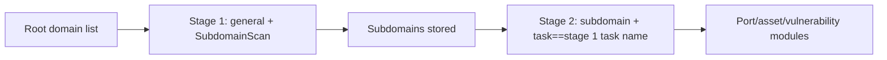

# ScopeSentry MCP Guide

For users of an **already deployed ScopeSentry instance**. Connect to the platform through Cursor (or another MCP client); no local source code is required.

## 1. Preparation

### 1.1 Confirm the service is reachable

- Default Web UI: `http://<host>`
- MCP endpoint: `http://<host>/mcp` (if a reverse proxy or frontend proxy sits in front, use the actual `/mcp` address)

### 1.2 Create an API Key

1. Sign in to the ScopeSentry Web UI in a browser.
2. Go to the **API Key** management page and create a key (or create one through the interface provided by your administrator).
3. Save the returned `ssk_...` string (**it is shown only once**).

### 1.3 Configure the Cursor MCP

Cursor → Settings → MCP → Add server:

```json
{
  "mcpServers": {
    "scopesentry": {
      "url": "http://<your-host>:8082/mcp",
      "headers": {
        "X-API-Key": "ssk_your_key"
      }
    }
  }
}
```

You can also use: `Authorization: Bearer ssk_your_key`

After configuring, restart the MCP or reload Cursor and confirm that tools such as `list_projects` and `list_assets` appear in the tool list.

---

## 2. Tool overview


| Tool                     | Purpose                |
| ---------------------- | ----------------- |
| `list_projects`        | Project tree grouped by tag (includes project IDs) |
| `list_projects_data`   | Paged project list, searchable by name     |
| `get_project`          | Project details              |
| `create_project`       | Create a project              |
| `list_tasks`           | Scan task list            |
| `get_task`             | Task details              |
| `list_scan_templates`  | Scan template list            |
| `get_scan_template`    | Template details              |
| `list_plugin_modules`  | Scan pipeline module names          |
| `list_plugins`         | Available plugins (with hash and default parameters) |
| `create_scan_template` | Create a scan template            |
| `create_scan_task`     | Create a scan task            |
| `list_assets`          | Query assets of all kinds (paged list)       |
| `count_assets`         | Count assets (`/api/assets/common/total`) |
| `get_asset_detail`     | Asset or vulnerability details           |
| `add_asset_tag`        | Add a tag to an asset           |
| `list_nodes`           | Scan node list            |


Each tool's parameters are defined by its MCP tool description (schema). `list_assets` and `count_assets` share the same `search` and `filter` syntax; read the `list_assets` description before querying assets.

When you need to know "how many in total", use `count_assets` (it corresponds to the Web paging total endpoint) instead of repeatedly paging through `list_assets` just to count.

---

## 3. Common workflows

### 3.1 Query assets by project

When the user or the context **already provides a project condition**, prefer passing `filter.project` to narrow the scope and avoid slow responses from pulling too much cross-project data. If there is no explicit project, you do not have to add a project filter.

1. Use `list_projects` or `list_projects_data` to obtain the target project's **ObjectID** (`id` / `children[].value`).
2. Pass `filter.project` to `list_assets` (**it must be the ID, not the project's display name**).

```json
{
  "asset_type": "asset",
  "pageIndex": 1,
  "pageSize": 20,
  "search": "domain=^example.com",
  "filter": {
    "project": ["<ProjectObjectID>"]
  }
}
```

### 3.2 Create a scan task

1. Use `list_nodes` to get the names of online nodes.
2. Use `list_scan_templates` or `create_scan_template` to get the template **ObjectID**.
3. `create_scan_task`: `name` and `node` are required; `template` takes the template ID (not the template name).

**Target source `targetSource` (same as the Web UI):**

| targetSource | Description | Required parameters |
| --- | --- | --- |
| `general` | Enter targets directly | `target` |
| `project` | Read targets from a project | `project` (array of project ObjectIDs) |
| `asset` | Search the Web asset library | `search`; optional `project`, `filter`, `targetNumber` |
| `RootDomain` | Search the root domain library | `search`; optional `project`, `filter`, `targetNumber` |
| `subdomain` | Search the subdomain library | `search`; optional `project`, `filter`, `targetNumber` |
| `UrlScan` | Search URL scan results | `search`; optional `project`, `filter`, `targetNumber` |
| `*Source` (e.g. `subdomainSource`) | Created from "select/search" on the asset page | use `search` when `targetTp=search`; use `targetIds` when `targetTp=select` |

**Example — scanning root domains directly:**

```json
{
  "name": "example-subdomain-collection",
  "node": ["node-1"],
  "template": "<TemplateObjectID>",
  "targetSource": "general",
  "target": "example.com\nfoo.com",
  "project": ["<ProjectObjectID>"]
}
```

**Example — continuing from the subdomain library (filtered by the previous task name):**

```json
{
  "name": "example-port-and-vulns",
  "node": ["node-1"],
  "template": "<FollowUpModuleTemplateObjectID>",
  "targetSource": "subdomain",
  "search": "task==\"example-subdomain-collection\"",
  "project": ["<ProjectObjectID>"]
}
```

### 3.3 Full information gathering for root domains (two stages recommended)

When the input is a **root domain** and you need **full information gathering**, run two separate scans instead of the whole pipeline in one pass.

**Why:** distributed tasks are dispatched per **single target**. When a root domain is the target, once a node is assigned that root domain, subdomains discovered on that node also keep running their follow-up modules on the same node, which easily causes uneven load, slowness and errors.

**Best practice:**

1. **Stage 1 — subdomain collection only**
   - `targetSource`: `general`
   - `target`: all root domains (multiple lines)
   - Template: enable only `SubdomainScan` and `SubdomainSecurity` (subdomain scanning + subdomain takeover)
   - Use `get_task` to wait for the task to finish

2. **Stage 2 — follow-up modules**
   - `targetSource`: `subdomain`
   - `search`: `task=="<stage 1 task name>"` (exact match on the task name)
   - Optionally narrow the scope with `project`
   - Template: port scanning, asset mapping, vulnerability scanning, etc. (may omit SubdomainScan)
   - Subdomains are dispatched to nodes as independent targets, which is more efficient in parallel

You can also filter by task name on the "Subdomain" asset page in the Web UI and use "create task from subdomains" for the same effect.



### 3.4 Create a scan template

1. `list_plugin_modules` → list of module names
2. `list_plugins` (can be filtered by `module`) → each plugin's `hash` and default `parameter`
3. `create_scan_template`: use `modules` to specify "module → array of plugin hashes"

---

## 4. Asset queries (`list_assets` / `count_assets`)

`count_assets` uses the same `asset_type`, `search` and `filter` as `list_assets` and returns `{ "total": N }`, corresponding to `/api/assets/common/total` on the Web side.

```json
{
  "asset_type": "subdomain",
  "search": "task==\"some task name\"",
  "filter": {"project": ["<ProjectObjectID>"]}
}
```

**Performance advice (applies to both `list_assets` and `count_assets`):** when a project condition exists, use `filter.project` first to narrow the scope; in `search`, prefer `==` exact match or `^` prefix match on indexed fields (see [4.3](#43-search-expressions)) and avoid large-scale `=` fuzzy queries that slow responses down. When there is no project context, do not force a project filter.

The types that support `filter.project` are listed in the [4.4](#44-filter-exact-filtering) table.

### 4.1 Asset types `asset_type`

`asset`, `RootDomain`, `subdomain`, `app`, `mp`, `UrlScan`, `SensitiveResult`, `DirScanResult`, `crawler`, `vulnerability`, `PageMonitoring`, `IPAsset`, `SubdomainTakerResult`

Alias examples: `web`→asset, `vuln`→vulnerability, `ip`→IPAsset, `url`→UrlScan

### 4.2 Parameter reference


| Parameter                       | Description                                      |
| ------------------------ | --------------------------------------- |
| `pageIndex` / `pageSize` | Paging, defaults to 1 / 20                            |
| `search`                 | Search expression (see the next section)                              |
| `filter`                 | Exact filter JSON (see the next section)                          |
| `sort`                   | Only UrlScan and DirScanResult support sorting by `length` |
| `sid`                    | SensitiveResult only: sensitive rule name                |


`search` and `filter` **can be used together**.

### 4.3 search expressions

A custom DSL (**not SQL**):


| Operator  | Meaning   | Index | Example                          |
| ---- | ---- | ---- | --------------------------- |
| `=`  | Fuzzy match (regex) | Does not use the index | `domain=example`            |
| `==` | Exact match (equality) | **Uses the index** | `port==443`                 |
| `!=` | Exclude   | — | `port!="80"`               |
| `&&` | AND    | — | `domain==example.com && port==443` |
| `||` | OR    | — | `title=admin || body=login` |


**Indexes and operators:** fields such as `domain`, `ip`, `port` and `title` are indexed, but only **`==` exact match** or a **prefix match whose value starts with `^`** (for example `domain=^example.com`) use the index; **`=` is turned into a regex fuzzy match and cannot use the index**, so it tends to get slow when there is a lot of data.

**search fields common to all types:** `tag`, `task` (task name), `rootDomain`

**project cannot be written in search** (it is invalid, or errors when combined with `&&`). To filter by project, use `filter.project`.

**Common search fields per type:**


| asset_type           | Fields                                                                                  |
| -------------------- | ----------------------------------------------------------------------------------- |
| asset                | domain, ip, port, service, app, title, statuscode, icon, banner, type, body, header |
| RootDomain           | domain, icp, company                                                                |
| subdomain            | domain, ip, type, value                                                             |
| app                  | name, icp, company, category, description, url, apk                                 |
| mp                   | name, icp, company, category, description, url                                      |
| UrlScan              | url, input, source, resultId, type                                                  |
| SensitiveResult      | url, sname, body, info, md5                                                         |
| DirScanResult        | url, statuscode, redirect, length                                                   |
| vulnerability        | url, vulname, matched, request, response, level                                     |
| crawler              | url, method, body, resultId                                                         |
| PageMonitoring       | url, hash, diff, response                                                           |
| IPAsset              | ip, domain, port, service, webServer, app                                           |
| SubdomainTakerResult | domain, value, type, response                                                       |


**search examples:**

- `domain==www.example.com && port==443` (exact match, uses the index)
- `domain=^example.com` (prefix match, uses the index)
- `ip==192.168.1.1`
- `task=="some task name"`
- `level==high` (vulnerability)
- `statuscode==200` (DirScanResult)

Use `=` only when fuzzy containment is needed, for example `title=admin` (it does not use the index, so combine it with a project or other conditions to narrow the scope).

### 4.4 filter exact filtering

A JSON object: multiple values for the same key are **OR**, different keys are **AND**.

**Prefer `project` when a project condition exists:** if the user or the context makes the project clear and the asset_type supports `project`, include it to narrow the scope; when there is no project information, do not force it.


| filter key   | Meaning       | Value notes                                                     |
| ------------ | -------- | -------------------------------------------------------- |
| `project`    | Owning project     | **ObjectID**, obtained with `list_projects` / `list_projects_data` |
| `task`       | Source task     | **Task name**, the `name` from `list_tasks`                         |
| `port`       | Port       | e.g. `"443"`                                                |
| `service`    | Service/protocol    | e.g. `"https"`                                              |
| `app`        | Application fingerprint     | e.g. `"Nginx"`                                              |
| `icon`       | Icon hash  |                                                          |
| `statuscode` | HTTP status code | Mainly for asset                                               |
| `status`     | Status       | UrlScan/DirScan HTTP code; vulnerability/sensitive finding handling status                       |
| `level`      | Vulnerability level     | critical / high / medium / low / info                    |
| `type`       | Type       | e.g. subdomain record type A, CNAME                                         |
| `color`      | Sensitive rule color   | SensitiveResult                                          |
| `sname`      | Sensitive rule name    | SensitiveResult                                          |
| `tags`       | Tags       |                                                          |


**Available filter keys per type:**


| asset_type                            | filter key                                                      |
| ------------------------------------- | --------------------------------------------------------------- |
| asset                                 | project, port, service, app, icon, statuscode, type, task, tags |
| RootDomain                            | project, tags                                                   |
| subdomain                             | project, type, task, tags                                       |
| app / mp                              | project, tags                                                   |
| UrlScan                               | status, tags                                                    |
| DirScanResult                         | status, tags                                                    |
| SensitiveResult                       | status, color, sname, tags                                      |
| crawler                               | project, task, tags                                             |
| vulnerability                         | project, level, status, task, tags                              |
| PageMonitoring / SubdomainTakerResult | tags                                                            |
| IPAsset                               | project, port, service, app                                     |


**filter example:**

```json
{"project": ["<ProjectObjectID>"], "port": ["443"]}
```

**Combined query example:**

```json
{
  "asset_type": "asset",
  "search": "domain=^baidu && port==443",
  "filter": {"project": ["<ProjectObjectID>"]},
  "pageIndex": 1,
  "pageSize": 10
}
```

**Notes:**

- When a project condition exists, prefer including `filter.project` (where supported); when there is no project context it is not mandatory
- Do not put the project display name in `filter.project`
- Use `==` for known values and `^` for prefixes; avoid abusing `=` fuzzy matching on large tables
- For UrlScan, use `filter.status` for the HTTP status; for DirScanResult you can use `statuscode==200` in search
- For SensitiveResult by rule name: use `sname=rule_name` in `search`, or `filter.sname`

### 4.5 Sorting sort

Only **UrlScan** and **DirScanResult** support it:

```json
{"length": "ascending"}
```

Other types ignore `sort` and use the default time-based ordering.

---

## 5. Scan template module names

`TargetHandler`, `SubdomainScan`, `SubdomainSecurity`, `PortScanPreparation`, `PortScan`, `PortFingerprint`, `AssetMapping`, `AssetHandle`, `URLScan`, `WebCrawler`, `URLSecurity`, `DirScan`, `VulnerabilityScan`, `PassiveScan`

---

## 6. Troubleshooting


| Symptom        | Handling                                                 |
| --------- | -------------------------------------------------- |
| No tools in MCP   | Check the URL, the API Key, and whether ScopeSentry is running                    |
| 401 / 403 | Recreate or replace the API Key                                    |
| Assets not found     | Confirm that `filter.project` is an ObjectID; do not put project in search |
| Template/task creation fails | `template` must be the template ObjectID; `node` takes the online node name            |
| Queries are slow/stuck   | When a project exists add `filter.project`; switch indexed fields to `==` or `^` prefixes and use `=` less; reduce `pageSize` |


---
